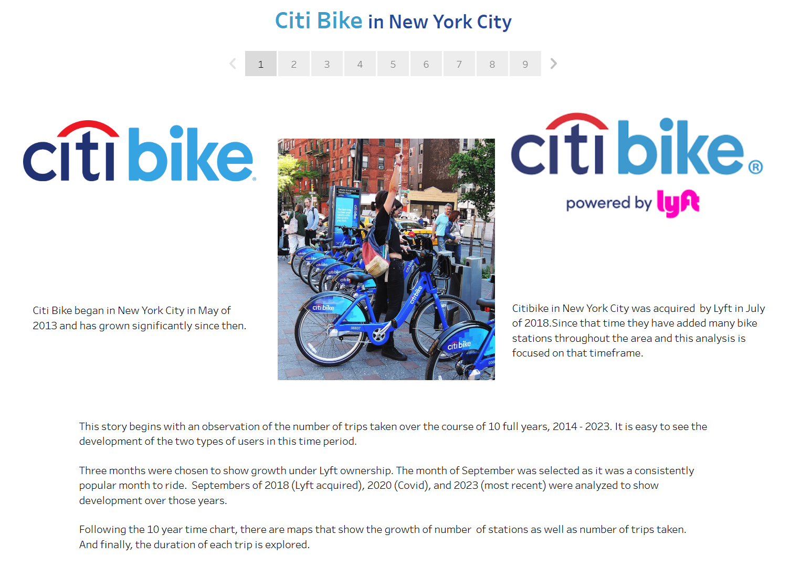
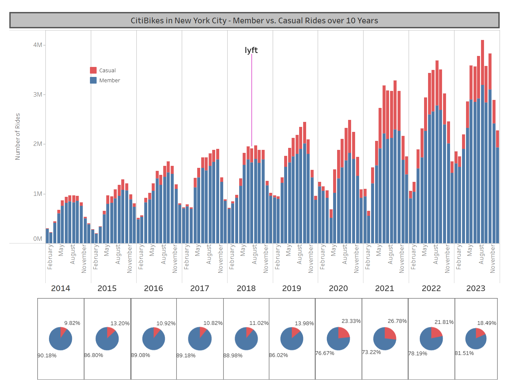
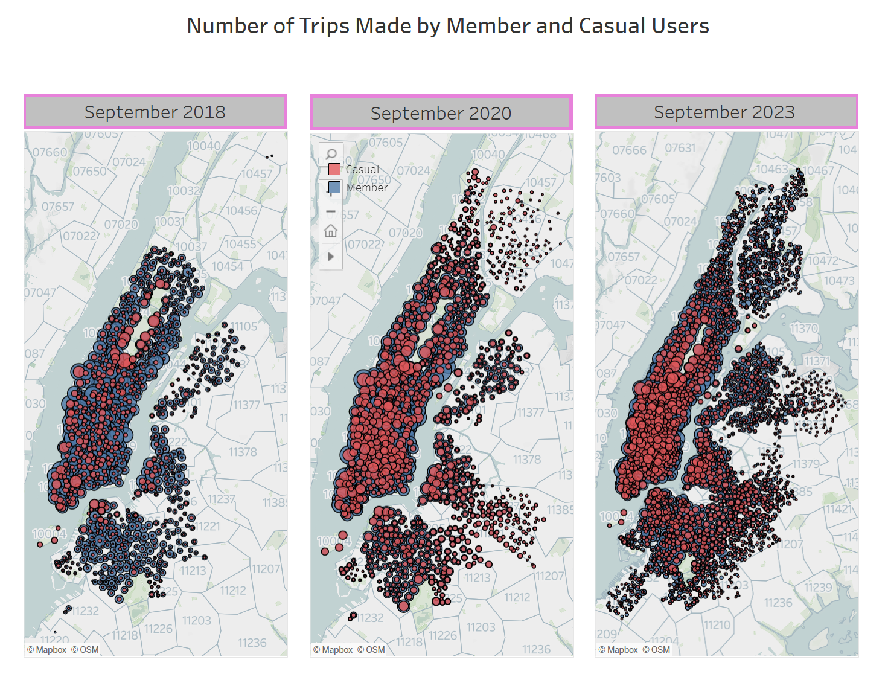
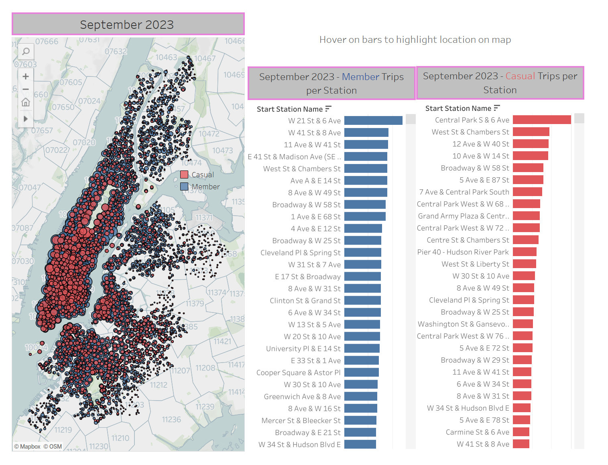
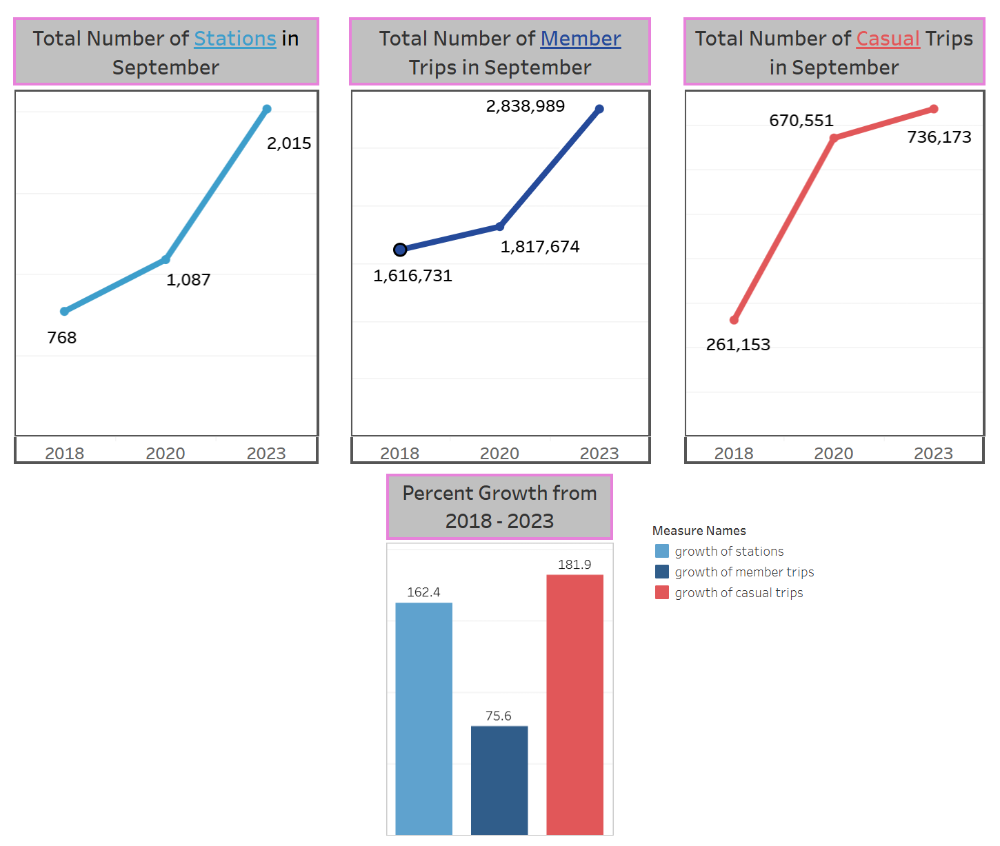
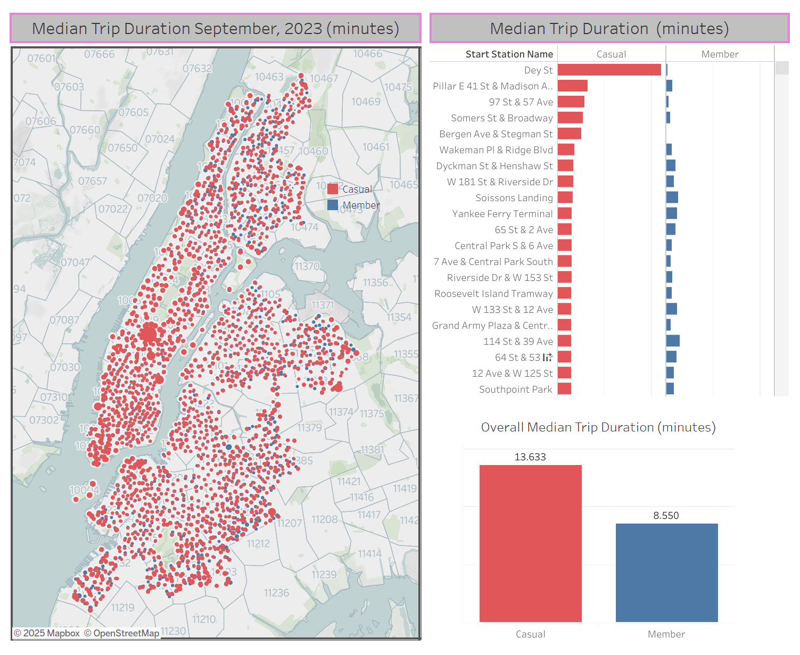

# Tableau-Preprocessing

This challenge was based on Citi Bikes in New York City. The assignment was to report on several different data phenomenon and to generate reports for city officials looking to publicize and improve the city program. Since 2013, the Citi Bike program has implemented a robust infrastructure for collecting data on the program's utilization. Each month, bike data is collected, organized, and made public on the Citi Bike DataLinks to an external site.  

[https://citibikenyc.com/system-data](https://citibikenyc.com/system-data)  

What I found most interesting was comparisons of rider types. A rider could be a member rider who would pay a monthly fee, or a casual rider who would pay by the ride. Observing trends in this area would be useful to understand strategic pricing as well as who to market toward in both rider types.

The visualization would be done in the Tableau Public platform. Since this platform is limited to work with only 1 Gigabyte of storage, this quickly became an exercise in data preprocessing for me.

I wanted to show the trend of member vs casual riders over the span of ten years (2013-2023) on a monthly basis. That amount of data far surpassed the limit of Tableau Public, so I created a program that could batch through each of the monthly data files and extract, calculate, and append key data information into one file that was only 125 Kilobytes in size. 

This allowed me to bring in larger, more robust files to observe further data points from 2018 - the year lyft took over, 2020 - the year Covid hit, and 2023 - the most current year.

Below shows my analysis and screenshots of the visualizations I created in Tableau.  

Please link to my [Tableau Story](https://public.tableau.com/app/profile/cindy.hansel/viz/Tableau-Challenge_17090121812760/citibikeinNYC?publish=yes) for an interactive experience.  

The following charts show the increase in ridership from 2014 through 2023. The growth is particularly high after 2020. Thears of 202 through 2022 showed noticeably higher percentages of casual users, topping off at 26% in 2021. From there, it shows a drop back below 20% by 2023.  

The maps below show the increase in the spread of stations as well as the growth of the number of trips per station. Again, the quick increase of casual trips is evident in the increase of the red circles from 2018 to 2020.  

An interesting note is the popularity of casual riders around Central Park in all 3 years. 

The following shows more information on the bike wation popularity.

The most popular station for member rides is W 21 St & 6 Ave, at 5,949 rides. As can be seen by hovering over the bars, several of the most used stations by casual riders surround Central Park.

The charts below feature the percentage growth from the initial year of Lyft ownership, 2018, through the most recent year, 2023.

- **# of bike stations grew 162.4%**
- **# of member rides grew 75.6%**
- **# of casual rides grew 181.9%**

Finally, we observe the duration of trips in 2023. It is clear that casual riders are more likely to have a longer ride than member riders.

- **The median trip duration of casual riders is approximately 13.6 minutes.**  
- **The median trip duration of member riders is approximately 8.6 minutes.**

Dey St has the highest median trip duration of 220 minutes for casual riders, and  
Heights Elevator has the highest median duration os 29.4 minutes for member users.

